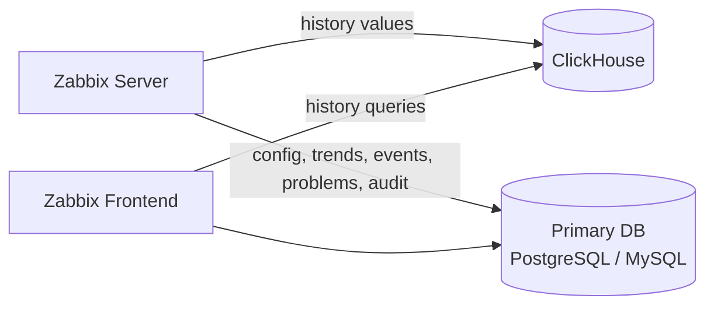

# Storing history data in ClickhouseDB

ClickHouse is a high-performance, column-oriented database management system built
for analytical workloads. Beginning with Zabbix 8, it can be used as an external
history storage backend, allowing history data to be offloaded from the primary
database while trends, configuration, and other operational data remain where
they've always lived.

For environments collecting large volumes of monitoring data, this architecture
significantly reduces load on the primary database and improves overall scalability.

In this chapter, you will install ClickHouse and configure it for use with
Zabbix 8, import the required history schema, and verify that Zabbix is successfully
storing history in ClickHouse.

## What Moves to ClickHouse — and What Doesn't

Before diving into the installation, it's worth being precise about what ClickHouse
actually takes over, since this is usually the first question readers ask.

ClickHouse stores **history data only**, the raw, per-item values collected by Zabbix
(numeric, string, text, log, and JSON). Everything else stays in the primary database:

* **Configuration data** — hosts, items, triggers, templates, users, actions,
  and so on
* **Trends** — the hourly aggregated min/avg/max data used for long-term graphing
* **Events and problems** — the operational state Zabbix uses to evaluate and display
  problems
* **Audit log**
* **Other operational tables** (sessions, queues, discovered hosts, etc.)

> **In short**: the primary database (PostgreSQL or MySQL) remains the single
  source of truth for *what Zabbix is* and *what it currently thinks is
  wrong*. ClickHouse becomes the place where the raw measurement history
  lives, optimized for the kind of high-volume, append-only, time-series
  writes that relational databases handle less gracefully at scale.

The high-level flow looks like this:



With that distinction in mind, let's set up the backend.

## Lab Environment

The examples in this chapter were tested using:

* Rocky Linux 9
* ClickHouse 26.6.1.1193
* Zabbix 8

## Installing ClickHouse

Begin by installing the official ClickHouse repository and packages.

```bash
dnf install -y dnf-plugins-core
dnf config-manager --add-repo https://packages.clickhouse.com/rpm/clickhouse.repo
dnf install -y clickhouse-server clickhouse-client
```

Enable the ClickHouse service so it starts automatically at boot.

```bash
systemctl enable clickhouse-server
systemctl start clickhouse-server
```

Verify that the service is running before continuing.

```bash
systemctl status clickhouse-server
```

## Configuring ClickHouse

By default, ClickHouse only listens on the loopback interface. That's fine when
Zabbix and ClickHouse run on the same host, but many environments use a dedicated
ClickHouse server or cluster instead.

Create the following configuration file:

`/etc/clickhouse-server/config.d/listen.xml`

```xml
<clickhouse>
    <listen_host>0.0.0.0</listen_host>
</clickhouse>
```

Reload the configuration by restarting ClickHouse.

```bash
systemctl restart clickhouse-server
```

## Correcting Filesystem Permissions

ClickHouse needs write access to its data directory. Incorrect ownership or SELinux
contexts are a common source of startup failures or permission errors during database
creation.

Ensure the directory has the correct ownership and permissions.

```bash
chown -R clickhouse:clickhouse /var/lib/clickhouse
chmod 0750 /var/lib/clickhouse
restorecon -Rv /var/lib/clickhouse
```

## Creating the Database

Connect to ClickHouse:

```bash
clickhouse-client
```

Create the Zabbix database:

```sql
CREATE DATABASE zabbix;
```

## Creating the Zabbix User

Create a dedicated database user for Zabbix:

```sql
CREATE USER zabbix
IDENTIFIED WITH sha256_password
BY 'zabbix';
```

Grant the required privileges:

```sql
GRANT ALL ON zabbix.* TO zabbix;
```

Exit the client and verify connectivity over HTTP:

```bash
curl -u zabbix:zabbix \
"http://127.0.0.1:8123/?database=zabbix&query=SELECT%201"
```

The command should return:

``` bash
1
```

This confirms the HTTP interface is working and the user has sufficient permissions.

## Importing the Zabbix History Schema

The Zabbix source distribution contains helper scripts that automatically create
the required ClickHouse tables.

Navigate to the ClickHouse database scripts:

```bash
cd database/clickhouse
```

Execute each schema script:

```bash
./history_schema.sh \
    --server http://127.0.0.1:8123 \
    --db zabbix \
    --user zabbix \
    --password zabbix
```

Repeat the process for the remaining history types:

``` bash
history_uint_schema.sh
history_str_schema.sh
history_text_schema.sh
history_log_schema.sh
history_json_schema.sh
```

Once complete, ClickHouse will contain a separate table for every supported Zabbix
history value type.

## Configuring Retention and Partitioning

The schema generation scripts let you customize both data retention and partitioning
at creation time.

### Configuring Retention (TTL)

Each history table includes a Time-To-Live (TTL) expression that automatically
removes old history data. By default, the scripts retain history for 31
days (2,678,400 seconds).

To retain history for 90 days instead, specify:

```bash
--ttl 7776000
```

The generated table will include:

```sql
TTL clock_ns + toIntervalSecond(7776000)
```

Unlike traditional databases, ClickHouse removes expired data automatically during
background merge operations, there's no housekeeping job to schedule or monitor.

### Choosing a Partitioning Strategy

The default partitioning strategy creates one partition per day:

```bash
--partition toDate
```

Daily partitions work well for smaller installations, but can result in a very
large number of partitions over time. Larger environments generally benefit
from monthly partitions instead:

```bash
--partition toYYYYMM
```

This produces tables similar to:

```sql
ENGINE = MergeTree
PARTITION BY toYYYYMM(clock_ns)
PRIMARY KEY (itemid, clock_ns)
ORDER BY (itemid, clock_ns)
TTL clock_ns + toIntervalSecond(7776000)
```

Monthly partitions typically strike the best balance between:

* partition count
* merge efficiency
* retention management
* query performance

For most production deployments, monthly partitions combined with an appropriate
TTL are recommended.

**Example:**

```bash
./history_uint_schema.sh \
    --server http://127.0.0.1:8123 \
    --db zabbix \
    --user zabbix \
    --password zabbix \
    --ttl 7776000 \
    --partition toYYYYMM
```

## Configuring Zabbix

Edit the Zabbix server configuration file:

`/etc/zabbix/zabbix_server.conf`

Configure ClickHouse as the history provider:

```
HistoryProvider=clickhouse;value_types="uint,dbl,str,log,text,json",url=http://127.0.0.1:8123,db=zabbix,username=zabbix,password="zabbix"
```

When using ClickHouse 26.6 or another version newer than officially supported,
also set:

```
AllowUnsupportedDBVersions=1
```

Save the configuration file.

## Verifying the Configuration

Before restarting the server, validate the configuration:

```bash
zabbix_server -T
```

Restart the Zabbix server:

```bash
systemctl restart zabbix-server
```

Monitor the log:

```bash
tail -f /var/log/zabbix/zabbix_server.log
```

A successful connection produces output similar to:

```bash
retrieving history provider "clickhouse" information
history provider "clickhouse" version "26.6.1.1193"
```

At this point, newly collected history values are being written directly
to ClickHouse.

## Verifying ClickHouse

A few simple commands confirm that ClickHouse is functioning correctly.

Check the installed version:

```bash
clickhouse-client --query "SELECT version()"
```

Verify that the HTTP interface is operational:

```bash
curl http://127.0.0.1:8123/ping
```

Expected output:

```bash
Ok.
```

List the imported tables:

```sql
SHOW TABLES;
```

Expected output:

```bash
history
history_uint
history_str
history_text
history_log
history_json
```

If all six tables are present and Zabbix reports a successful connection, the
history backend is correctly configured.

## Backups

It's worth treating ClickHouse's backup strategy as a separate decision from your
primary database's backup strategy, rather than assuming they should mirror each
other.

For many organizations, raw history data is effectively disposable: it's valuable
for troubleshooting and short-term analysis, but it isn't the system of record
for configuration or for the current state of problems, that all lives in the
primary database, which still needs rigorous, tested backups. Depending on your
retention requirements and risk tolerance, ClickHouse history may warrant a
lighter-weight approach, such as periodic snapshots or simply relying on TTL-based
expiry and re-collection, rather than the same RPO/RTO targets you'd apply to
PostgreSQL or MySQL.

If you do need durable ClickHouse backups, for example, to satisfy a compliance
requirement around historical data retention — tools like `clickhouse-backup` can
perform consistent backups of MergeTree tables without stopping the server. Weigh
this against your actual retention needs before adding the operational overhead.

## Looking Ahead: Clusters and High Availability

This chapter covers a single-node ClickHouse instance, which is sufficient for many
lab and small production environments. For larger or high-availability deployments,
ClickHouse supports clustering through **ClickHouse Keeper** (for coordination),
**ReplicatedMergeTree** tables (for data redundancy across nodes), and **distributed
tables** (to query across shards transparently).

## Troubleshooting

### ClickHouse Cannot Create Tables — Permission Denied

If ClickHouse reports a permission error such as:

``` bash
Permission denied
```

verify the ownership and SELinux contexts:

```bash
chown -R clickhouse:clickhouse /var/lib/clickhouse
restorecon -Rv /var/lib/clickhouse
```

Restart ClickHouse afterward.

### Zabbix Cannot Connect to ClickHouse

Verify connectivity manually:

```bash
curl -u zabbix:zabbix \
"http://127.0.0.1:8123/?database=zabbix&query=SELECT%201"
```

When Zabbix and ClickHouse run on the same server, prefer `http://127.0.0.1:8123`
over a hostname, this avoids potential DNS or hostname resolution issues.

## questions


## Useful URLs

[https://clickhouse.com/docs/faq/operations/delete-old-data](https://clickhouse.com/docs/faq/operations/delete-old-data)
[https://clickhouse.com/docs/](https://clickhouse.com/docs/)
